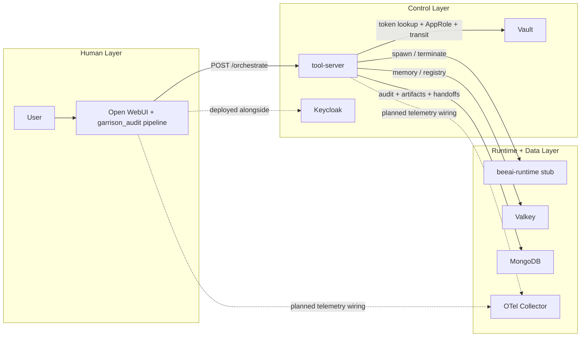
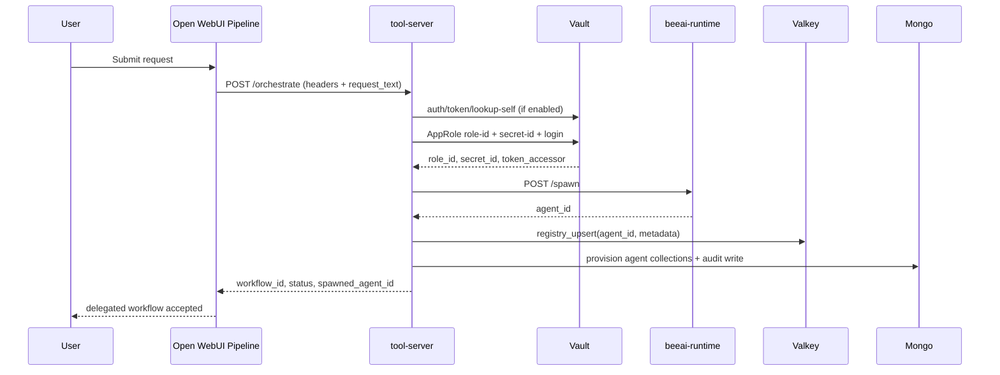

# Project Garrison

Project Garrison is an auditable, policy-driven agent runtime. It separates human identity from agent identity, routes all agent operations through a policy chokepoint, and validates secret lifecycle controls end to end.

## Current Implementation Snapshot

- Human interaction is through Open WebUI.
- Runtime control is through tool-server.
- Agent execution is through a BeeAI runtime stub service.
- Vault is used for token lookup, AppRole issuance, and transit encryption/decryption.
- Valkey backs shared memory and registry data.
- MongoDB stores audit events and per-agent collections.
- OpenTelemetry Collector is present and currently exports to debug output in local mode.

## Architecture

Notes about accuracy:

- Keycloak realm/client/role/group baseline is now provisioned during bootstrap for deterministic local OIDC/RBAC setup.
- Open WebUI auth is enabled by default, with claim-based orchestration gates in the garrison pipeline.
- OTel collector local config currently exports to debug.
- tool-server now emits audit events as OTLP logs to the collector endpoint.
- Open WebUI garrison_audit pipeline now emits inlet/outlet OTLP logs to the collector endpoint.
- Open WebUI orchestrate bearer token is issued at bootstrap from Vault with scoped policies and agent metadata (no static compose root token).
- Fluent Bit -> tool-server audit ingest token is generated at bootstrap and injected at runtime (no static compose token literal).
- Open WebUI pipeline enforces claim-based orchestration authorization (required role/group and `sub`/`iss` identity claims) before calling tool-server.
- Open WebUI pipeline validates OIDC token claims for orchestration authorization (`iss`, `aud`, `exp` with skew tolerance).
- Open WebUI role/group authorization mapping mode is configurable (`any` or `all`).
- Nginx is active in local compose as the outbound fetch proxy for tool-server.
- Fluent Bit is active in local compose, tails Vault and Nginx logs, and forwards records to tool-server internal audit ingest endpoints that persist to MongoDB.

## Request and Delegation Flow

## Runtime APIs

Tool-server primary endpoints:

- Health: GET /health
- Memory: GET/POST/DELETE /tools/memory/{key}
- Scratch: GET/POST/DELETE /tools/scratch/{key}
- Registry: GET /tools/registry
- Fetch: POST /tools/fetch
- Summarize: POST /tools/summarize
- Transit encrypt/decrypt: POST /tools/encrypt, POST /tools/decrypt
- Search: POST /tools/search
- Handoff: POST /tools/handoff
- Spawn lifecycle: POST /tools/spawn, DELETE /tools/spawn/{agent_id}
- Orchestration bridge: POST /orchestrate

Internal endpoints used by local audit pipeline:

- Audit ingest: POST /internal/audit/ingest/{source}

## Security and Policy Model

- All runtime calls require Bearer auth and agent identity headers.
- Vault token lookup is enabled in compose via TOOL_SERVER_REQUIRE_TOKEN_LOOKUP=true.
- Vault token metadata contract is enforced (`agent_id` and `agent_class` claims required under strict binding).
- Spawn/terminate is orchestrator-only.
- Spawn depth is capped by TOOL_SERVER_SPAWN_MAX_DEPTH (currently 2).
- Nested spawn/delete is constrained by root_orchestrator_id ownership checks.
- Human session propagation is enforced through x-human-session-id and orchestration payloads.
- OTEL forwarding from tool-server is best-effort and does not block request handling.

## Telemetry Settings

- TOOL_SERVER_OTEL_ENABLED (default: true)
- TOOL_SERVER_OTEL_LOGS_ENDPOINT (default internal endpoint: `otel-collector:4318/v1/logs`)
- TOOL_SERVER_OTEL_TIMEOUT_MS (default: 2000)

Open WebUI pipeline settings:

- GARRISON_OTEL_ENABLED (default: true)
- GARRISON_OTEL_LOGS_ENDPOINT (default internal endpoint: `otel-collector:4318/v1/logs`)
- GARRISON_OTEL_TIMEOUT_SECONDS (default: 2)

## Infrastructure as Code Status

Terraform/OpenTofu now provisions provider-backed resources in spec module order under modules and terraform.

- Root composition: terraform/main.tf
- Shared variables: terraform/variables.tf
- Contract outputs: terraform/outputs.tf

Current Phase 7 posture:

- CI smoke workflow is active.
- Terraform/OpenTofu init, validate, and apply paths are active.
- Vault core, PKI, dynamic secrets, transit, policy, and AppRole resources are managed by Terraform modules.
- Skill documents are rendered by Terraform and can be published to Gitea when enabled.
- Script-based Vault checks are retained as parity validators after Terraform apply.

## Operations

Primary commands from repository root:

- Full local bootstrap and verification (default script-managed Vault path): bash scripts/bootstrap.sh
- Full local bootstrap and verification (Terraform Vault path): GARRISON_TERRAFORM=true bash scripts/bootstrap.sh
- Single command CI-equivalent smoke run (default script path): bash scripts/ci-smoke.sh
- Single command CI-equivalent smoke run (Terraform Vault path): GARRISON_TERRAFORM=true bash scripts/ci-smoke.sh
- Standalone audit evidence check: bash scripts/audit-pipeline-check.sh
- Standalone Keycloak baseline + verification: bash scripts/keycloak-bootstrap.sh && bash scripts/keycloak-readiness.sh
- Tool-server tests: cd tool-server && python -m pytest -q tests
- Pipeline tests: cd open-webui/pipelines && python -m pytest -q test_garrison_audit.py

See detailed operational guidance in OPERATIONS-RUNBOOK.md.

## Documentation Site

Project documentation source lives in docs and is published through GitHub Pages by workflow .github/workflows/docs-pages.yml.

Local preview after installing MkDocs:

- mkdocs serve
- mkdocs build --strict
