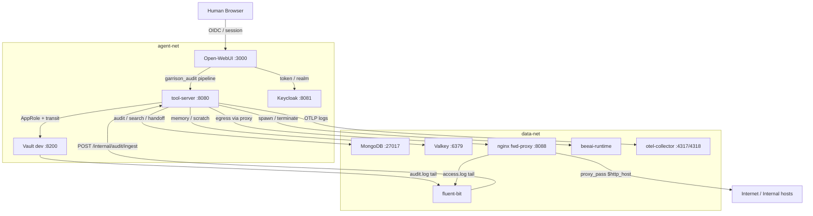
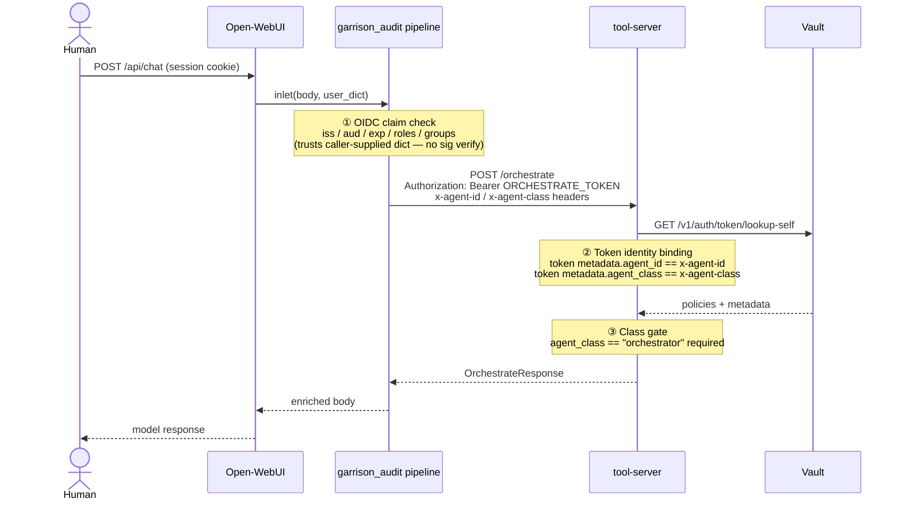
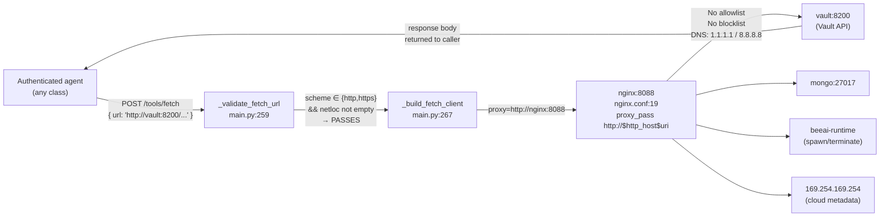
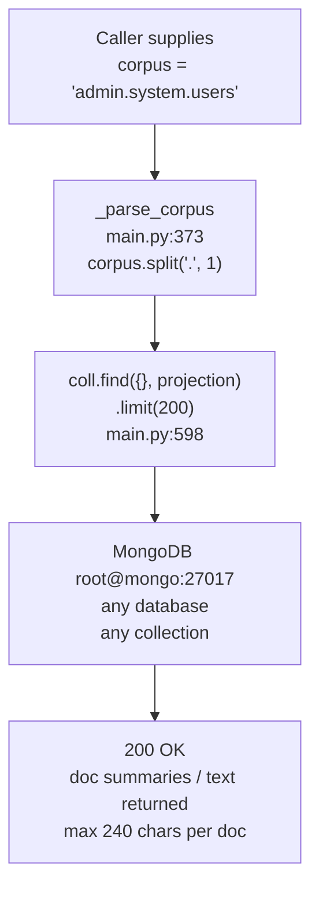
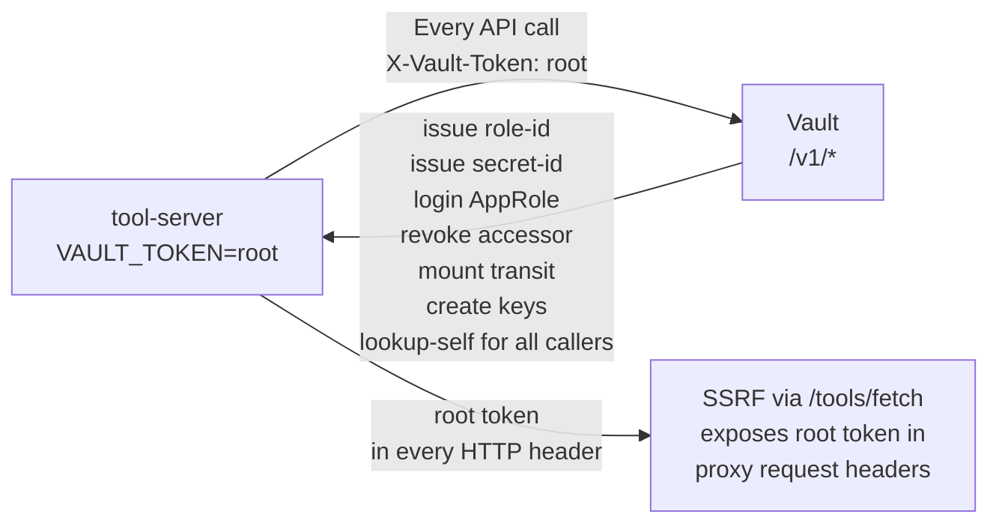
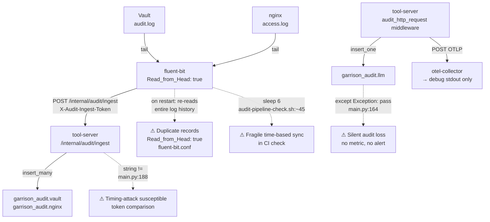
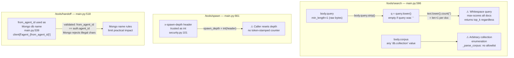
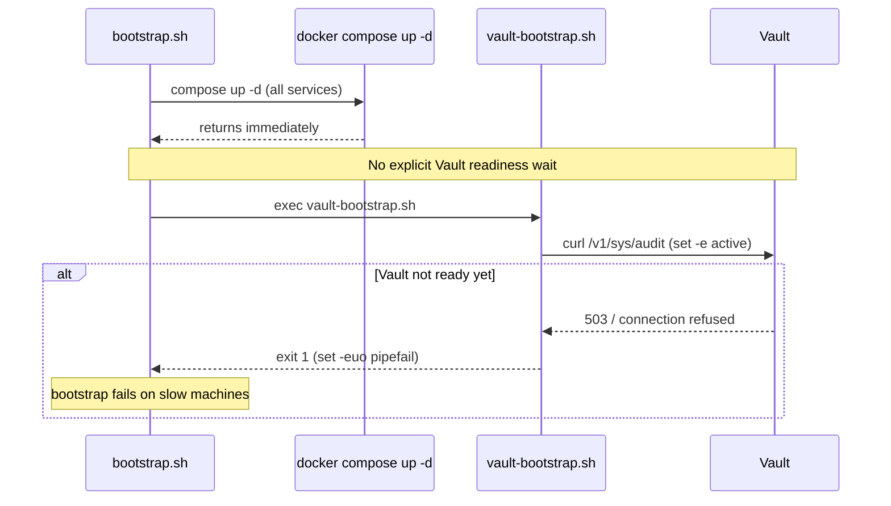

# Project Garrison — Security & Correctness Audit

## Table of Contents

1. [Architecture Overview](#1-architecture-overview)
2. [Security Posture](#2-security-posture)
3. [Secret Handling](#3-secret-handling)
4. [Correctness](#4-correctness)
5. [Finding Summary](#5-finding-summary)

---

## 1. Architecture Overview

Project Garrison is a locally-hosted, policy-driven agent runtime. A human user authenticates through Open WebUI (backed by Keycloak OIDC), whose pipeline forwards requests to the `tool-server`. The `tool-server` acts as the sole policy chokepoint: it validates Vault tokens, enforces identity binding, and mediates access to tools (fetch, search, memory, encrypt/decrypt, spawn). Agent sub-processes authenticate via Vault AppRole and receive short-lived tokens scoped to their class policies. Audit events flow through Fluent Bit (log tail → HTTP ingest) and the OTel Collector.



Every service port is bound on `0.0.0.0` and forwarded to the host interface — there is no host-level firewall in the compose configuration.

---

## 2. Security Posture

### 2.1 Identity & Authorization Chain

The following sequence shows the full chain from human request to tool execution, annotating the three security boundaries that must hold simultaneously.



**Boundary ① — OIDC (pipeline):** `_authorize_orchestration` in [`garrison_audit.py:73`](https://github.com/mcindi/project-garrison/blob/main/open-webui/pipelines/garrison_audit.py#L73) reads claims from the `user` dict supplied by Open WebUI. It checks `iss`, `aud`, `exp`, roles, and groups — but performs **no cryptographic signature verification**. The trust anchor is whatever Open WebUI's own middleware already validated. A misconfigured or downgraded Open WebUI instance, or any direct POST to the `tool-server` that bypasses the pipeline, entirely skips this boundary.

**Boundary ② — Vault token lookup:** Enforced when `TOOL_SERVER_REQUIRE_TOKEN_LOOKUP=true` and `TOOL_SERVER_ENFORCE_TOKEN_IDENTITY_BINDING=true` (both set in [`compose.yaml:129`](https://github.com/mcindi/project-garrison/blob/main/compose.yaml#L129)). This is the strongest boundary — it contacts Vault on every request. However the steady-state credential in Vault is the **root token** (discussed in §3), so a leaked bearer token already carries root-level Vault access.

**Boundary ③ — Agent class gate:** Enforced in [`main.py:381`](https://github.com/mcindi/project-garrison/blob/main/tool-server/app/main.py#L381) and [`main.py:627`](https://github.com/mcindi/project-garrison/blob/main/tool-server/app/main.py#L627). Solid for spawn and orchestrate endpoints.

---

### 2.2 SSRF via `/tools/fetch` and the Unbounded Forward Proxy

This is the highest-impact exploitable chain in the current build.



`_validate_fetch_url` at [`main.py:259`](https://github.com/mcindi/project-garrison/blob/main/tool-server/app/main.py#L259) only rejects non-`http`/`https` schemes and empty netlocs. There is no allowlist, no private-range blocklist, and no blocklist of `169.254.169.254`. The nginx forward proxy at [`nginx.conf:19`](https://github.com/mcindi/project-garrison/blob/main/config/nginx/nginx.conf#L19) uses `proxy_pass http://$http_host$uri$is_args$args` — it blindly forwards to any destination resolvable from the container network, including all other compose services. Because `fetch_require_proxy=true` is set, all fetches route through nginx and are logged — but logging is not egress control.

A `code`-class or `rag`-class agent can reach `http://vault:8200/v1/sys/...` and retrieve the full Vault API response, including any sensitive mount metadata. Combined with the root token embedded in `compose.yaml`, this turns SSRF into full Vault compromise without any credential.

---

### 2.3 Cross-Collection MongoDB Enumeration via `/tools/search`



`_parse_corpus` at [`main.py:373`](https://github.com/mcindi/project-garrison/blob/main/tool-server/app/main.py#L373) splits on the first `.` and directly uses the result as `client[db_name][coll_name]`. The `SearchRequest.corpus` field is validated only for presence — its value is fully caller-controlled. An authenticated agent can enumerate any collection in any MongoDB database by name, including `admin.system.users`, `garrison_audit.llm`, and `agent_<other_agent_id>.handoffs`. The `query` parameter is only used for in-memory scoring *after* the database read; the read itself has no predicate.

---

### 2.4 Hardcoded Credentials on `0.0.0.0`-Exposed Ports

| Service | Credential | Location | Host Port |
|---|---|---|---|
| MongoDB | `root` / `rootpass` | [`compose.yaml:16`](https://github.com/mcindi/project-garrison/blob/main/compose.yaml#L16) | 27017 |
| Valkey | `rootpass` | [`compose.yaml:6`](https://github.com/mcindi/project-garrison/blob/main/compose.yaml#L6) | 6379 |
| Vault | root token `root` | [`compose.yaml:28`](https://github.com/mcindi/project-garrison/blob/main/compose.yaml#L28) | 8200 |
| Keycloak admin | `admin` / `admin` | [`compose.yaml:87`](https://github.com/mcindi/project-garrison/blob/main/compose.yaml#L87) | 8081 |
| Keycloak OIDC client | `garrison-openwebui-secret` | [`keycloak-bootstrap.sh`](https://github.com/mcindi/project-garrison/blob/main/scripts/keycloak-bootstrap.sh) | — |
| tool-server runtime | Vault root token `root` | [`compose.yaml:128`](https://github.com/mcindi/project-garrison/blob/main/compose.yaml#L128) | — |
| beeai-runtime | `BEEAI_API_KEY=demo` | [`compose.yaml:43`](https://github.com/mcindi/project-garrison/blob/main/compose.yaml#L43) | — |

All data-plane ports (27017, 6379, 8200) are bound on the default Docker interface which is `0.0.0.0` unless an explicit bind address is given. On a developer workstation with a routable LAN address, these are reachable from the local network.

---

### 2.5 Spawn-Depth Header Spoofing

`x-spawn-depth` is a caller-supplied header trusted by `require_auth_context` at [`security.py:101`](https://github.com/mcindi/project-garrison/blob/main/tool-server/app/security.py#L101). The depth is not stamped into the Vault token metadata. A spawned agent that received an AppRole token (class: `rag` or `code`) cannot call `/tools/spawn` because the class gate at [`main.py:381`](https://github.com/mcindi/project-garrison/blob/main/tool-server/app/main.py#L381) blocks non-orchestrators. However, any `orchestrator`-class token with `x-spawn-depth: 0` overrides the depth counter regardless of how it was originally issued, resetting the `spawn_max_depth=2` guardrail.

---

### 2.6 Broken Redaction in Open WebUI Pipeline

```python
# garrison_audit.py:118-119
for secret_key in ("authorization", "token", "password", "secret", "api_key"):
    text = text.replace(secret_key, f"{secret_key}_redacted")
```

This replaces the **key name** substring, not the value. Given the payload `{"password":"hunter2"}`, the output is `{"password_redacted":"hunter2"}` — the plaintext secret is preserved. The mode `"full"` (the default from [`compose.yaml:97`](https://github.com/mcindi/project-garrison/blob/main/compose.yaml#L97)) sends the entire body to OTel stdout, but users who configure `GARRISON_AUDIT_PAYLOAD_MODE=redacted` receive a false sense of protection. Compare with the `tool-server`'s correct implementation at [`main.py:64`](https://github.com/mcindi/project-garrison/blob/main/tool-server/app/main.py#L64), which uses regex substitution to replace the *value*.

---

## 3. Secret Handling

### 3.1 Secret Provenance and Flow

```mermaid
flowchart TD
    subgraph static["Static Secrets (committed / hardcoded)"]
        S1["Vault root token\n'root'\ncompose.yaml:28+128"]
        S2["Mongo root:rootpass\ncompose.yaml:16-17\nvault-bootstrap.sh:113"]
        S3["Valkey rootpass\ncompose.yaml:6"]
        S4["Keycloak admin:admin\ncompose.yaml:87-88"]
        S5["OIDC client secret\n'garrison-openwebui-secret'\nkeycloak-bootstrap.sh"]
    end

    subgraph dynamic["Dynamic Secrets (good hygiene)"]
        D1["Audit ingest token\ngenerated per-bootstrap\nissue-audit-ingest-token.sh"]
        D2["Orchestrate bearer token\n1h TTL, Vault-minted\nissue-openwebui-token.sh"]
        D3["AppRole secret-ids\nnum_uses:1, 30m TTL\nprovisioning.py:87-93"]
        D4["Mongo dynamic creds\n1h default / 24h max TTL\nvault-bootstrap.sh:115-117"]
    end

    subgraph exposure["Exposure Paths"]
        E1["/tmp/garrison-creds-*.json\nplaintext on disk\nvault-dynamic-secrets-check.sh:96"]
        E2["OTel collector stdout\ndebug verbosity: detailed\ncollector.yaml:11-12"]
        E3["audit_http_request middleware\nfull payload default\nmain.py:156+163"]
        E4["curl -d flag\nprocess list visible\nvault-policy-check.sh"]
        E5["compose env vars\nPROC environ visible\ncompose.yaml"]
    end

    S1 --> E5
    S2 --> E5
    D2 --> E5
    D1 --> E5
    D3 --> E4
    D4 --> E1
    E3 --> E2
```



**The dominant risk is static.** The Vault root token, Mongo/Valkey root credentials, Keycloak admin password, and OIDC client secret are all defined at rest in `compose.yaml` and bootstrap scripts tracked by git. Rotation requires a full redeploy. In contrast, the dynamic secrets (audit ingest token, orchestrate bearer, AppRole secret-ids, DB creds) exhibit good hygiene — short TTLs, single-use secret-ids, and per-run generation.

---

### 3.2 Tool-Server Vault Privilege



The `tool-server` uses the Vault root token for every operation: token lookup, AppRole provisioning, transit key creation, and accessor revocation. This is acknowledged as a known gap in `docs/auth-hardening-plan.md`. The root token has no expiry, no policy restrictions, and full Vault API access. Compromise of the `tool-server` process, its environment, or its memory results in immediate full Vault compromise. The intended hardening is to mint a dedicated AppRole for the `tool-server` itself — this work is not yet implemented.

---

### 3.3 Dynamic Credential Exposure

`vault-dynamic-secrets-check.sh` writes issued Vault DB credentials to `/tmp/garrison-creds-<role>.json` at [`line 96`](https://github.com/mcindi/project-garrison/blob/main/scripts/vault-dynamic-secrets-check.sh#L96). These files are world-readable by default (subject only to process umask) and persist across invocations since there is no cleanup step. The files contain plaintext `username`, `password`, `lease_id`, and `lease_duration`. Similarly, lease lookup responses are written to `/tmp/garrison-lease-lookup.json` at [`line 47`](https://github.com/mcindi/project-garrison/blob/main/scripts/vault-dynamic-secrets-check.sh#L47).

---

### 3.4 OTel Telemetry Leak

The OTel Collector at [`collector.yaml:11`](https://github.com/mcindi/project-garrison/blob/main/config/otel/collector.yaml#L11) exports everything to the `debug` exporter with `verbosity: detailed`. Every audit event — including the `request_payload` field that defaults to the full request body — is printed to the collector's stdout. Because `payload_mode` defaults to `"full"`, any request body containing credentials, conversation content, or agent task context flows into `docker logs otel-collector`. There is no backend exporter (no Loki, Jaeger, or Prometheus configured), making this purely a data-leakage sink.

---

## 4. Correctness

### 4.1 Audit Pipeline Reliability



Four correctness issues affect the audit pipeline:

1. **Duplicate records on Fluent Bit restart** — `Read_from_Head true` in [`fluent-bit.conf`](https://github.com/mcindi/project-garrison/blob/main/config/fluent-bit/fluent-bit.conf) causes Fluent Bit to re-read the entire log file from the beginning on every restart, producing duplicate audit records in MongoDB with no deduplication key.

2. **Silent audit loss** — The `garrison_audit.llm` insert at [`main.py:164`](https://github.com/mcindi/project-garrison/blob/main/tool-server/app/main.py#L164) is wrapped in `except Exception: pass`. Mongo downtime, network issues, or schema errors cause records to be silently dropped. There is no counter, alert, or fallback write.

3. **Non-constant-time token comparison** — The audit ingest token check at [`main.py:188`](https://github.com/mcindi/project-garrison/blob/main/tool-server/app/main.py#L188) uses `!=` string comparison. While network timing jitter dominates in practice, `hmac.compare_digest` is the correct primitive for secret comparison.

4. **Time-based CI sync** — `audit-pipeline-check.sh` uses `sleep 6` to wait for Fluent Bit to flush, making the CI check racy on loaded machines.

---

### 4.2 Input Validation Gaps



**Whitespace query bypass** — `SearchRequest.query` has `min_length=1` enforced by Pydantic on the raw string. A query of `" "` (single space) passes validation, then `body.query.strip()` at [`main.py:593`](https://github.com/mcindi/project-garrison/blob/main/tool-server/app/main.py#L593) produces an empty string `q`. `text.lower().count("")` returns `len(text)+1` for every document, scoring all docs at maximum and returning the `top_k` results regardless of relevance — effectively turning a scored search into an unfiltered dump.

**`_spawn_with_auth` retry loop** — The three-attempt retry at [`main.py:401`](https://github.com/mcindi/project-garrison/blob/main/tool-server/app/main.py#L401) has no sleep between attempts. On a slow or unavailable `beeai-runtime`, this creates a tight busy-loop against the upstream service, potentially amplifying load.

---

### 4.3 Bootstrap Reliability



[`bootstrap.sh`](https://github.com/mcindi/project-garrison/blob/main/scripts/bootstrap.sh) launches all services with `compose up -d` then immediately executes `vault-bootstrap.sh`. There is no readiness polling loop for Vault before the bootstrap attempts API calls. `vault-bootstrap.sh` runs under `set -euo pipefail`, so a 503 or connection failure on the first `api_get "/v1/sys/audit"` at [`vault-bootstrap.sh:46`](https://github.com/mcindi/project-garrison/blob/main/scripts/vault-bootstrap.sh#L46) terminates the entire bootstrap. `keycloak-bootstrap.sh` includes a proper `wait_for_keycloak` poll loop; Vault lacks the equivalent.

---

### 4.4 Container Hardening Gaps

Neither [`tool-server/Dockerfile`](https://github.com/mcindi/project-garrison/blob/main/tool-server/Dockerfile) nor [`beeai-runtime/Dockerfile`](https://github.com/mcindi/project-garrison/blob/main/beeai-runtime/Dockerfile) include a `USER` directive. Both containers run as UID 0 (root). Combined with Vault's `IPC_LOCK` capability (`cap_add: IPC_LOCK` in [`compose.yaml:26`](https://github.com/mcindi/project-garrison/blob/main/compose.yaml#L26)) and bootstrap's use of `docker compose exec -T -u root vault`, the attack surface within the container network is materially elevated. No `HEALTHCHECK` is defined in any Dockerfile, making compose-level health gating unavailable. Base image tags (`python:3.11-slim`, `nginx:1.27-alpine`) are not pinned to digests, allowing silent base image drift.

Additionally, [`logs/nginx/`](https://github.com/mcindi/project-garrison/tree/main/logs/nginx/) access and error logs appear to be tracked by git (the `logs/` gitignore rule post-dates their addition). These files may contain historical request data including internal IP addresses and URL patterns.

---

## 5. Finding Summary

| # | Finding | Severity | File / Line |
|---|---|---|---|
| F-01 | Vault root token is the steady-state runtime credential for `tool-server` | **Critical** | [`compose.yaml:128`](https://github.com/mcindi/project-garrison/blob/main/compose.yaml#L128) |
| F-02 | SSRF via `/tools/fetch` — no host/range allowlist, nginx proxies to any destination | **Critical** | [`main.py:259`](https://github.com/mcindi/project-garrison/blob/main/tool-server/app/main.py#L259), [`nginx.conf:19`](https://github.com/mcindi/project-garrison/blob/main/config/nginx/nginx.conf#L19) |
| F-03 | `/tools/search` corpus is fully caller-controlled — cross-collection enumeration | **High** | [`main.py:373`](https://github.com/mcindi/project-garrison/blob/main/tool-server/app/main.py#L373), [`main.py:598`](https://github.com/mcindi/project-garrison/blob/main/tool-server/app/main.py#L598) |
| F-04 | Hardcoded weak credentials on all data services, all bound `0.0.0.0` | **High** | [`compose.yaml:6`](https://github.com/mcindi/project-garrison/blob/main/compose.yaml#L6) |
| F-05 | Keycloak OIDC client secret hardcoded in bootstrap script | **High** | [`keycloak-bootstrap.sh`](https://github.com/mcindi/project-garrison/blob/main/scripts/keycloak-bootstrap.sh) |
| F-06 | Vault runs in `-dev` mode — no TLS, no persistence, unsealed always | **High** | [`compose.yaml:30`](https://github.com/mcindi/project-garrison/blob/main/compose.yaml#L30) |
| F-07 | Broken redaction in pipeline `_payload_repr` — renames key, not value | **High** | [`garrison_audit.py:118`](https://github.com/mcindi/project-garrison/blob/main/open-webui/pipelines/garrison_audit.py#L118) |
| F-08 | Pipeline OIDC checks trust caller-supplied claims — no signature verification | **Medium** | [`garrison_audit.py:73`](https://github.com/mcindi/project-garrison/blob/main/open-webui/pipelines/garrison_audit.py#L73) |
| F-09 | Spawn depth enforcement relies on a caller-supplied header | **Medium** | [`security.py:101`](https://github.com/mcindi/project-garrison/blob/main/tool-server/app/security.py#L101) |
| F-10 | OTel collector exports only to debug stdout — full audit payloads in container logs | **Medium** | [`collector.yaml:11`](https://github.com/mcindi/project-garrison/blob/main/config/otel/collector.yaml#L11) |
| F-11 | Dynamic secret check writes plaintext DB creds to `/tmp` with no cleanup | **Medium** | [`vault-dynamic-secrets-check.sh:96`](https://github.com/mcindi/project-garrison/blob/main/scripts/vault-dynamic-secrets-check.sh#L96) |
| F-12 | Containers run as root — no `USER` directive in either Dockerfile | **Medium** | [`tool-server/Dockerfile`](https://github.com/mcindi/project-garrison/blob/main/tool-server/Dockerfile) |
| F-13 | Silent audit loss — `insert_one` failure swallowed with bare `except: pass` | **Medium** | [`main.py:164`](https://github.com/mcindi/project-garrison/blob/main/tool-server/app/main.py#L164) |
| F-14 | Fluent Bit `Read_from_Head: true` produces duplicate audit records on restart | **Low** | [`fluent-bit.conf`](https://github.com/mcindi/project-garrison/blob/main/config/fluent-bit/fluent-bit.conf) |
| F-15 | Audit ingest token comparison uses `!=` — not constant-time | **Low** | [`main.py:188`](https://github.com/mcindi/project-garrison/blob/main/tool-server/app/main.py#L188) |
| F-16 | Whitespace-only query bypasses `min_length` and dumps all docs | **Low** | [`main.py:593`](https://github.com/mcindi/project-garrison/blob/main/tool-server/app/main.py#L593) |
| F-17 | `_spawn_with_auth` retry loop has no backoff delay | **Low** | [`main.py:401`](https://github.com/mcindi/project-garrison/blob/main/tool-server/app/main.py#L401) |
| F-18 | Bootstrap has no Vault readiness wait — fails on slow machines | **Low** | [`bootstrap.sh`](https://github.com/mcindi/project-garrison/blob/main/scripts/bootstrap.sh), [`vault-bootstrap.sh:46`](https://github.com/mcindi/project-garrison/blob/main/scripts/vault-bootstrap.sh#L46) |
| F-19 | Credentials passed via `curl -d` flag — visible in process listings | **Low** | [`vault-policy-check.sh`](https://github.com/mcindi/project-garrison/blob/main/scripts/vault-policy-check.sh) |
| F-20 | nginx access/error logs appear committed to the repository | **Low** | [`logs/nginx/`](https://github.com/mcindi/project-garrison/tree/main/logs/nginx/) |
| F-21 | Base images not pinned to digests — silent drift possible | **Low** | [`tool-server/Dockerfile`](https://github.com/mcindi/project-garrison/blob/main/tool-server/Dockerfile) |

---

### Immediate Priorities

The three items that should be addressed before any networked deployment:

1. **F-01 + F-06:** Replace the Vault dev-mode root token with a dedicated AppRole for the `tool-server`, scoped to only the operations it actually needs. Move Vault to server mode with TLS. This is already documented as pending in `docs/auth-hardening-plan.md`.

2. **F-02:** Add a strict allowlist to `_validate_fetch_url` — reject RFC1918 ranges, link-local (`169.254.0.0/16`), loopback, and all Docker-internal service hostnames. Separately, replace nginx's wildcard `proxy_pass` with an explicit allowlist of permitted external domains.

3. **F-03:** Gate `/tools/search` corpus values against an allowlist of permitted database/collection names rather than splitting raw user input into Mongo coordinates.
