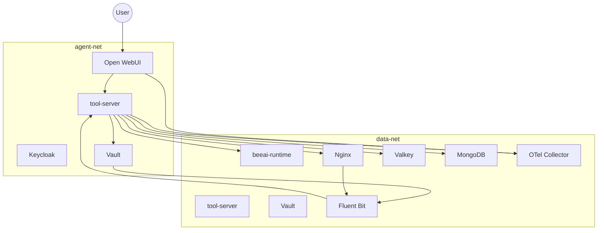

# Architecture

## Service Topology

## Runtime Responsibilities

- Open WebUI:
  - Human request entry point.
  - Pipeline hook that can call POST /orchestrate.
- tool-server:
  - Auth and policy enforcement.
  - Memory/scratch/search/fetch/summarize/encrypt/decrypt/handoff APIs.
  - Spawn and terminate governance.
  - Audit event emission.
- beeai-runtime (stub):
  - Spawn and terminate handlers with in-memory agent map.
- Vault:
  - Token lookup, AppRole role/secret issuance, transit operations.
- Nginx:
  - Outbound fetch proxy used by tool-server.
- Fluent Bit:
  - Tails Vault audit and Nginx access logs.
  - Forwards records to tool-server internal ingest endpoints.
- Valkey:
  - Shared memory and registry data.
- MongoDB:
  - Stores tool-server audit events and ingested Vault/Nginx logs.
- OTel Collector:
  - Deployed in compose and configured with OTLP receiver plus debug exporter.
  - tool-server audit middleware emits OTLP logs to collector.
  - Open WebUI garrison pipeline emits OTLP logs to collector.

## Terraform Runtime Notes

- Vault baseline can be provisioned through script-managed bootstrap or Terraform/OpenTofu mode.
- CI uses containerized Terraform execution on the compose network for deterministic `vault` DNS reachability.
- Vault audit defaults are file-based; syslog audit is opt-in for environments with an available syslog sink.

## Design Constraints Enforced in Code

- Runtime requests require agent headers and bearer token.
- Orchestrator-only spawn/terminate.
- Spawn depth limit and root orchestrator lineage checks.
- human_session_id propagation across orchestration path.
