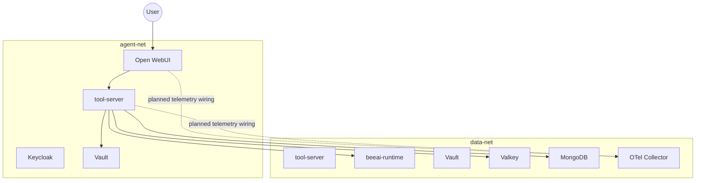

# Architecture

## Service Topology

## Runtime Responsibilities

- Open WebUI:
  - Human request entry point.
  - Pipeline hook that can call POST /orchestrate.
- tool-server:
  - Auth and policy enforcement.
  - Memory/scratch/search/fetch/summarize/encrypt/decrypt/handoff APIs.
  - Spawn and terminate governance.
  - Audit event emission.
- beeai-runtime (stub):
  - Spawn and terminate handlers with in-memory agent map.
- Vault:
  - Token lookup, AppRole role/secret issuance, transit operations.
- Valkey:
  - Shared memory and registry data.
- MongoDB:
  - Audit collection and per-agent database collections.
- OTel Collector:
  - Deployed in compose and configured with OTLP receiver plus debug exporter.
  - Current app code paths do not emit OTLP directly yet.

## Design Constraints Enforced in Code

- Runtime requests require agent headers and bearer token.
- Orchestrator-only spawn/terminate.
- Spawn depth limit and root orchestrator lineage checks.
- human_session_id propagation across orchestration path.
