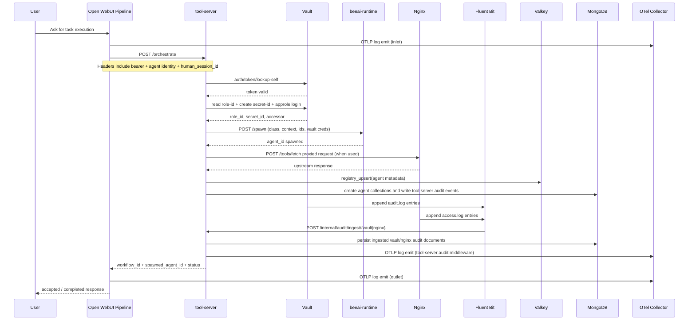
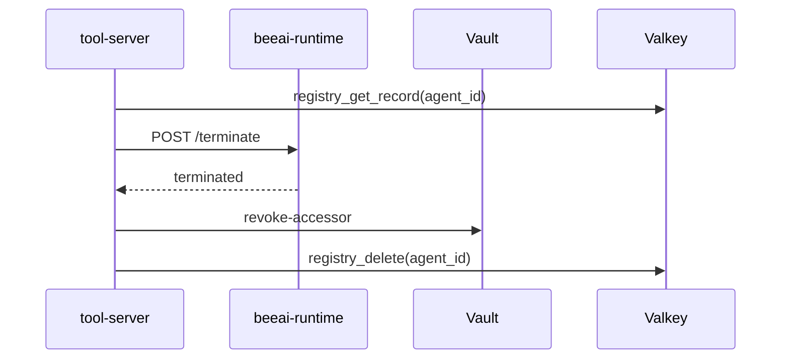

# Request Flow

## Human Request to Delegated Agent

## Termination Flow

## Failure Behavior

- If token lookup fails, request returns 401.
- If caller is not orchestrator for spawn/delete/orchestrate, request returns 403.
- If spawn depth exceeds configured max depth, request returns 403.
- Open WebUI pipeline orchestration errors are non-fatal to the UI request and captured in metadata.
